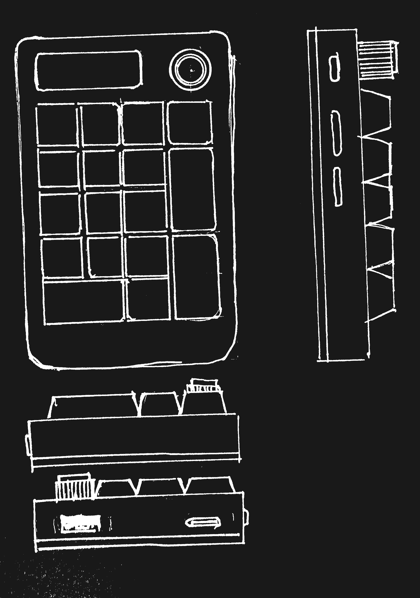

# Unkeyboard
Unkown? Unknown keyboard yes
---

# Todo
- [X] Mirar como incluir librerías en KiCAD para teclas.
- [X] Ventajas entre diodo vs encoder de desplazamiento. No es rentable porque hay que utilizar otro software.  
- [X] Mirar qué diodos disponibles hay o cuales comprar.
- [ ] Mirar cuales son los tipos de teclas más compatibles

## Resources
- https://github.com/system76/launch/tree/master
- https://github.com/system76/launch/tree/master/pcb-lite
- [https://github.com/system76/qmk_firmware/tree/master/keyboards/system76/launch_lite_1](https://github.com/system76/launch/tree/master/chassis)
- https://jlcpcb.com/coupon-center
- https://3d.jlcpcb.com/

