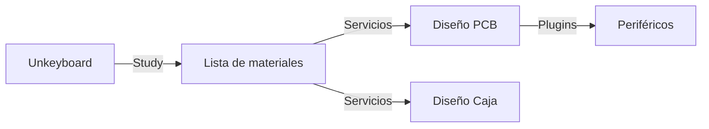

# Unkeyboard
Unkown? Unknown keyboard yes
---

## Ideas
Es un producto de ingeniería, no comercial; por lo que su diseño va a estar orientado a la utilidad en el uso para el ordenador. Debe poder cumplir con ser reparable.
La PCB es el elemento más importante ya que venimos de la ingeniería electrónica (Debe recibir más atención que el resto del diseño).
- Hot swapable
- Backlight/Sidilight
- Luz para Bloq-mayus
- Volumen encoder
- ? Barra táctil bajo barra espaciadora
- USB-C
- ? Bluetooth + 2.4 GHz
- Leds independientes
- Swicth para apagar
- ? Batería. Un módulo a parte que puede ser acoplado opcionalmente
  - ? Carga inalámbrica. Al menos dejar los contactos para soldarlo como opcional
- ? Canales en las filas de las teclas para la flexibilidad de PCB
- Plugins
  - Los plugins deben conectarse o por conexiones físicas o bluetooth LE.
  - Protocolos para la comunicación entre plugins: uart, i2c, canbus, USB
- Pines pare resetear el microcontrolador
- Top mount para mejorar el ruido. El sonido se ve reflejado hacia arriba
- Debe ser reparable

## Workline

## Resources
- https://github.com/system76/launch/tree/master
- https://github.com/system76/launch/tree/master/pcb-lite
- [https://github.com/system76/qmk_firmware/tree/master/keyboards/system76/launch_lite_1](https://github.com/system76/launch/tree/master/chassis)
- https://jlcpcb.com/coupon-center
- https://3d.jlcpcb.com/
